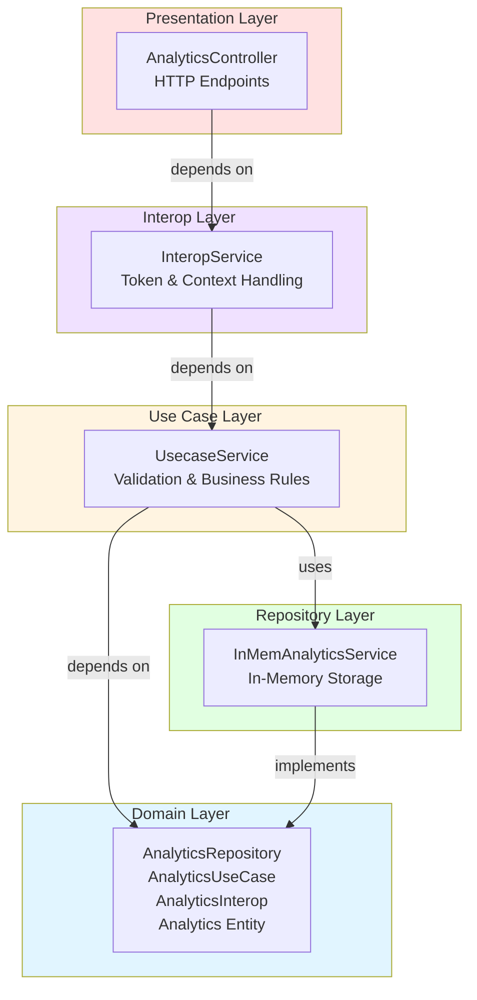
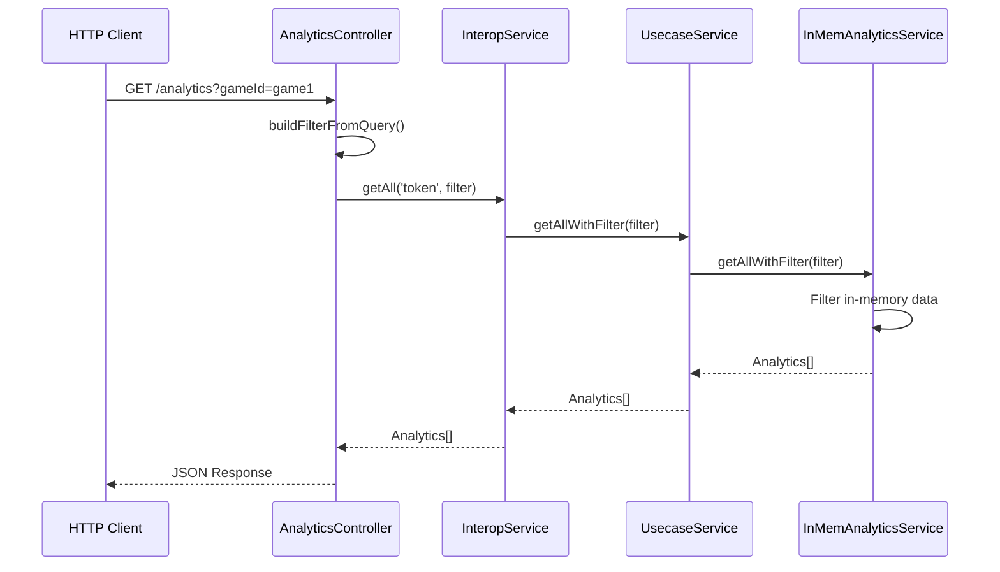
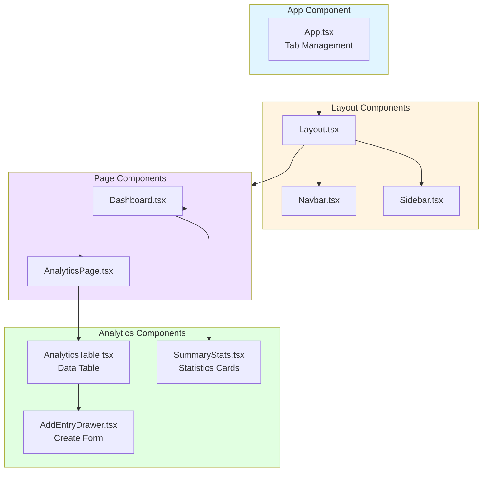
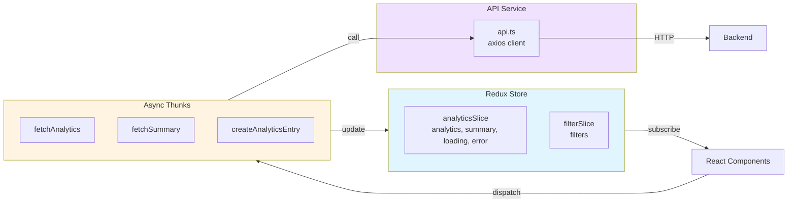
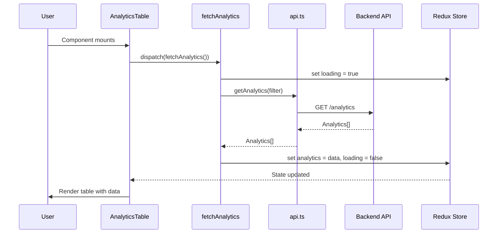
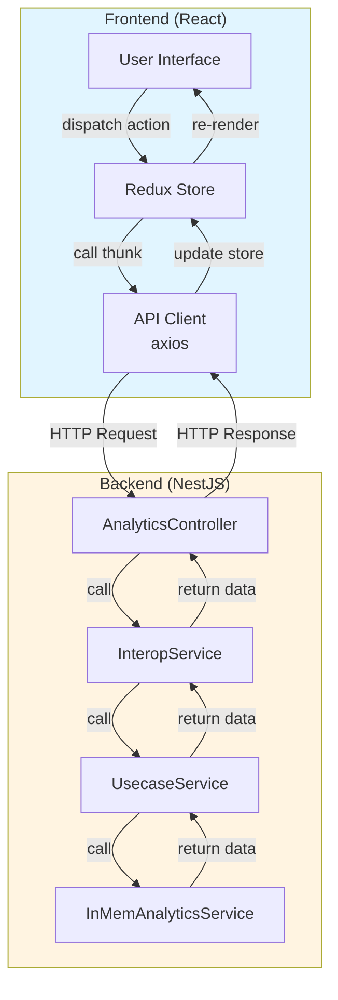

# Kiến trúc Hệ thống - Game Analytics Dashboard

Tài liệu này mô tả chi tiết kiến trúc của hệ thống Game Analytics Dashboard, bao gồm backend sử dụng Clean Architecture và frontend sử dụng React với Redux Toolkit.

---

## 📋 Mục lục

1. [Backend Architecture - Clean Architecture](#backend-architecture---clean-architecture)
2. [Frontend Architecture](#frontend-architecture)
3. [Integration & Data Flow](#integration--data-flow)
4. [Technology Stack](#technology-stack)

---

## Backend Architecture - Clean Architecture

### Tổng quan

Backend được xây dựng theo nguyên tắc **Clean Architecture** (Uncle Bob), đảm bảo:
- **Separation of Concerns**: Mỗi layer có trách nhiệm riêng biệt
- **Dependency Rule**: Dependencies chỉ hướng vào trong (inward)
- **Independence**: Business logic độc lập với framework, database, UI
- **Testability**: Dễ dàng test từng layer riêng biệt

### Kiến trúc Layers



### Chi tiết từng Layer

#### 1. Domain Layer (Entities & Interfaces)

**Vị trí**: `backend/src/domain/analytics.domain.ts`

**Trách nhiệm**:
- Định nghĩa các entities (Analytics, AnalyticsFilter, AnalyticsSummary)
- Định nghĩa các interfaces cho các layer khác
- Chứa domain exceptions
- **Không phụ thuộc** vào bất kỳ layer nào khác

**Các Interfaces chính**:

```typescript
// Repository Interface - Định nghĩa contract cho data access
interface AnalyticsRepository {
  getById(id: number): Analytics;
  post(analytics: Analytics): Analytics;
  put(analytics: Analytics): Analytics;
  delete(id: number): Analytics;
  getAll(): Analytics[];
  getAllWithFilter(filter: AnalyticsFilter): Analytics[];
}

// Use Case Interface - Định nghĩa contract cho business logic
interface AnalyticsUseCase {
  getById(id: number): Analytics;
  post(analytics: Analytics): Analytics;
  put(analytics: Analytics): Analytics;
  delete(id: number): Analytics;
  getAll(): Analytics[];
  getAllWithFilter(filter: AnalyticsFilter): Analytics[];
  getSummary(filter?: AnalyticsFilter): AnalyticsSummary;
}

// Interop Interface - Định nghĩa contract cho external interfaces
interface AnalyticsInterop {
  getById(token: string, id: number): Analytics;
  post(token: string, analytics: Analytics): Analytics;
  put(token: string, analytics: Analytics): Analytics;
  delete(token: string, id: number): Analytics;
  getAll(token: string, filter?: AnalyticsFilter): Analytics[];
  getSummary(token: string, filter?: AnalyticsFilter): AnalyticsSummary;
}
```

**Entities**:
- `Analytics`: Entity chính chứa thông tin game analytics
- `AnalyticsFilter`: Filter criteria cho queries
- `AnalyticsSummary`: Aggregated statistics

#### 2. Repository Layer (Data Access)

**Vị trí**: `backend/src/analytics/in-mem-analytics/in-mem-analytics.service.ts`

**Trách nhiệm**:
- Implement `AnalyticsRepository` interface
- Quản lý data persistence (hiện tại là in-memory)
- Xử lý filtering logic
- **Chỉ phụ thuộc** vào Domain Layer

**Implementation**:
- Sử dụng `DictionaryInt<Analytics>` để lưu trữ data trong memory
- Auto-generate ID nếu không được cung cấp
- Filtering theo: gameId, playerId, score range, date range

**Dependency Flow**:
```
Repository → Domain (chỉ phụ thuộc vào interfaces)
```

#### 3. Use Case Layer (Business Logic)

**Vị trí**: `backend/src/analytics/base/usecase/usecase.service.ts`

**Trách nhiệm**:
- Implement `AnalyticsUseCase` interface
- Chứa business logic và validation rules
- Xử lý business rules:
  - Validate score phải là số dương
  - Validate required fields (gameId, playerId)
  - Check duplicate entries
  - Auto-set timestamp nếu không có
- Tính toán summary statistics
- **Phụ thuộc** vào Domain và Repository (qua interface)

**Business Rules**:
1. Score validation: Phải là số và >= 0
2. Required fields: gameId và playerId bắt buộc
3. Duplicate check: Không cho phép tạo entry với ID đã tồn tại
4. Timestamp: Tự động set nếu không được cung cấp

**Dependency Flow**:
```
UseCase → Domain (interfaces)
UseCase → Repository (qua interface, không phụ thuộc implementation)
```

#### 4. Interop Layer (Interface Adapters)

**Vị trí**: `backend/src/analytics/base/interop/interop.service.ts`

**Trách nhiệm**:
- Implement `AnalyticsInterop` interface
- Xử lý external concerns (token, context, authentication)
- Adapter giữa Presentation và Use Case
- Chuyển đổi external requests thành use case calls
- **Phụ thuộc** vào Domain và Use Case

**Implementation**:
- Nhận token parameter (hiện tại chưa validate, chỉ pass through)
- Delegate calls đến Use Case layer
- Có thể thêm logging, monitoring ở layer này

**Dependency Flow**:
```
Interop → Domain (interfaces)
Interop → UseCase (qua interface)
```

#### 5. Controller Layer (Presentation)

**Vị trí**: `backend/src/analytics/analytics.controller.ts`

**Trách nhiệm**:
- Định nghĩa HTTP endpoints
- Xử lý HTTP requests/responses
- Parse query parameters thành filter objects
- **Chỉ phụ thuộc** vào Interop layer

**Endpoints**:
- `GET /analytics` - Lấy danh sách analytics (có filter)
- `GET /analytics/:id` - Lấy analytics theo ID
- `POST /analytics` - Tạo mới analytics entry
- `PUT /analytics` - Cập nhật analytics entry
- `DELETE /analytics/:id` - Xóa analytics entry
- `GET /analytics/summary` - Lấy summary statistics (có filter)

**Dependency Flow**:
```
Controller → Interop (qua interface)
```

### Dependency Injection

**Vị trí**: `backend/src/analytics/analytics.module.ts`

NestJS Module sử dụng Dependency Injection để wire các layers:

```typescript
@Module({
  providers: [
    {
      provide: 'AnalyticsRepository',  // Interface token
      useClass: InMemAnalyticsService    // Implementation
    },
    {
      provide: 'AnalyticsUseCase',
      useClass: UsecaseService
    },
    {
      provide: 'AnalyticsInterop',
      useClass: InteropService
    }
  ],
  controllers: [AnalyticsController]
})
```

**Lợi ích**:
- Loose coupling: Controller không biết implementation cụ thể
- Dễ test: Có thể mock các dependencies
- Dễ thay đổi: Thay đổi implementation mà không ảnh hưởng các layer khác

### Data Flow Diagram



### Lợi ích của Clean Architecture

1. **Maintainability**: Dễ bảo trì, mỗi layer có trách nhiệm rõ ràng
2. **Testability**: Có thể test từng layer độc lập
3. **Flexibility**: Dễ thay đổi implementation (ví dụ: thay in-memory bằng database)
4. **Scalability**: Dễ mở rộng thêm features mới
5. **Independence**: Business logic không phụ thuộc vào framework hay database

---

## Frontend Architecture

### Tổng quan

Frontend được xây dựng với **React** và **Redux Toolkit** cho state management, tuân theo các nguyên tắc:
- **Component-based**: Tách biệt UI thành các components có thể tái sử dụng
- **Unidirectional Data Flow**: Data flow một chiều từ store → components
- **Separation of Concerns**: Tách biệt UI, state management, và API calls

### Component Structure



### Component Hierarchy

```
App
├── Layout
│   ├── Navbar
│   └── Sidebar
└── [Content]
    ├── Dashboard
    │   └── SummaryStats
    └── AnalyticsPage
        └── AnalyticsTable
            └── AddEntryDrawer
```

### State Management (Redux Toolkit)

**Cấu trúc**: `frontend/src/store/`



#### Redux Slices

**1. Analytics Slice** (`store/slices/analyticsSlice.ts`)
- State: `analytics[]`, `summary`, `loading`, `error`
- Reducers: `clearError`
- Extra Reducers: Handle async thunks (pending, fulfilled, rejected)

**2. Filter Slice** (`store/slices/filterSlice.ts`)
- State: `filters` (AnalyticsFilter)
- Reducers: `setFilters`, `clearFilters`, `updateFilter`

#### Async Thunks

**Vị trí**: `frontend/src/store/thunks/analyticsThunks.ts`

- `fetchAnalytics`: Lấy danh sách analytics (có filter)
- `fetchSummary`: Lấy summary statistics (có filter)
- `createAnalyticsEntry`: Tạo mới analytics entry

**Flow**:
1. Component dispatch thunk
2. Thunk gọi API service
3. API service gửi HTTP request
4. Thunk update store dựa trên response

### API Integration Layer

**Vị trí**: `frontend/src/services/api.ts`

**Trách nhiệm**:
- Tạo axios client với base URL và headers
- Định nghĩa các API methods
- Xử lý query parameters
- Type-safe API calls

**Methods**:
- `getAnalytics(filter?)`: GET /analytics
- `getSummary(filter?)`: GET /analytics/summary
- `createAnalytics(data)`: POST /analytics

### Type System

**Vị trí**: `frontend/src/types/analytics.ts`

TypeScript interfaces đảm bảo type safety:
- `Analytics`: Entity type
- `AnalyticsFilter`: Filter type
- `AnalyticsSummary`: Summary type
- `CreateAnalyticsRequest`: Request type

### Component Details

#### 1. AnalyticsTable Component

**Vị trí**: `frontend/src/components/analytics/AnalyticsTable.tsx`

**Features**:
- Hiển thị data trong Ant Design Table
- Search functionality (client-side)
- Sorting (built-in Ant Design)
- Pagination
- Loading states
- Add new entry button

**State**:
- Local: `searchText`, `drawerOpen`
- Redux: `analytics`, `loading`

#### 2. SummaryStats Component

**Vị trí**: `frontend/src/components/analytics/SummaryStats.tsx`

**Features**:
- Hiển thị 7 statistics cards
- Responsive grid layout
- Loading states
- Auto-fetch on mount

**Statistics**:
- Total Entries
- Average Score
- Max/Min Score
- Total Games
- Unique Players
- Unique Games

#### 3. AddEntryDrawer Component

**Vị trí**: `frontend/src/components/analytics/AddEntryDrawer.tsx`

**Features**:
- Material-UI Drawer
- Form validation
- Error handling
- Success/error notifications
- Auto-refresh after create

### Data Flow trong Frontend



---

## Integration & Data Flow

### End-to-End Data Flow



### API Communication

**Request Flow**:
1. User action → Component dispatch thunk
2. Thunk → API service (axios)
3. API service → HTTP request to backend
4. Backend Controller → Interop → UseCase → Repository
5. Repository → Process data → Return
6. Response flows back through layers
7. Redux store updated
8. Component re-renders

**Error Handling**:
- Backend: Throws HTTP exceptions (NestJS)
- Frontend: Thunks catch errors → Update error state
- UI: Display error messages to user

### Data Transformation

**Backend → Frontend**:
- Backend: `timestamp: Date`
- Frontend: `timestamp: string` (ISO string)
- Transformation: Automatic by JSON serialization

**Frontend → Backend**:
- Frontend: `CreateAnalyticsRequest` (không có id, timestamp optional)
- Backend: `Analytics` (auto-generate id, timestamp)

### CORS Configuration

**Backend**: `main.ts`
```typescript
app.enableCors(); // Allow all origins (development)
```

Cho production, nên cấu hình cụ thể:
```typescript
app.enableCors({
  origin: process.env.FRONTEND_URL,
  credentials: true
});
```

---

## Technology Stack

### Backend

- **Framework**: NestJS 10.x
- **Language**: TypeScript 5.x
- **Architecture**: Clean Architecture
- **Storage**: In-memory (Dictionary)
- **HTTP**: Express (via NestJS)

### Frontend

- **Framework**: React 19.x
- **Language**: TypeScript 4.x
- **State Management**: Redux Toolkit 2.x
- **UI Libraries**:
  - Material-UI 7.x (Components)
  - Ant Design 6.x (Table)
- **HTTP Client**: Axios 1.x
- **Date Formatting**: date-fns 4.x
- **Styling**: SCSS + Material-UI theme

### Development Tools

- **Package Manager**: npm
- **Build Tool**: 
  - Backend: NestJS CLI
  - Frontend: Create React App (react-scripts)
- **Linting**: ESLint + Prettier
- **Testing**: Jest (backend), React Testing Library (frontend)

---

## Kết luận

Hệ thống được thiết kế với:
- **Backend**: Clean Architecture đảm bảo separation of concerns và testability
- **Frontend**: Component-based architecture với Redux Toolkit cho state management
- **Integration**: RESTful API với type-safe communication

Kiến trúc này cho phép:
- Dễ dàng mở rộng và bảo trì
- Test từng layer độc lập
- Thay đổi implementation mà không ảnh hưởng các layer khác
- Type safety từ backend đến frontend
